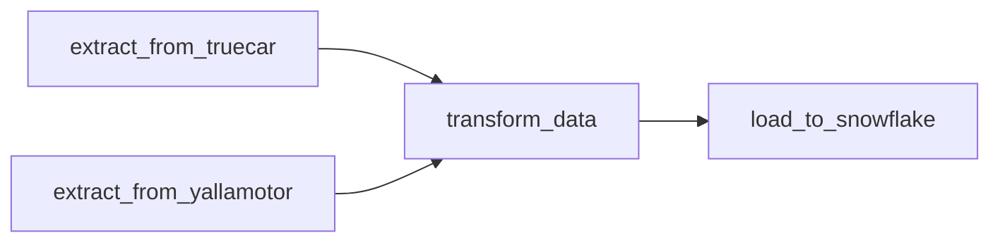

# 🚗 Automated Car Prices ETL Pipeline

A fully automated End-to-End Data Engineering pipeline orchestrated by **Apache Airflow**. This project extracts car pricing data from international markets (USA & Egypt), transforms it into a Star Schema, and loads it into **Snowflake** for analysis.

## 🎯 Project Overview

The goal is to monitor and analyze car price disparities between the US and Egyptian markets. The pipeline performs the following steps:
1.  **Extract:** Scrapes real-time data from **TrueCar** (USA) and **YallaMotor** (Egypt) in parallel.
2.  **Transform:** Cleans data, handles currency conversion, and models it into Dimension and Fact tables using **Pandas**.
3.  **Load:** Uploads the processed Star Schema tables directly into **Snowflake** Data Warehouse.
4.  **Visualize:** Power BI dashboard connected to Snowflake for insights.

## 🛠️ Tech Stack

* **Orchestration:** Apache Airflow
* **Data Warehouse:** Snowflake
* **ETL & Scripting:** Python, Pandas
* **Web Scraping:** BeautifulSoup4, Requests
* **Visualization:** Power BI

## 🏗️ Pipeline Architecture (Airflow DAG)

The Airflow DAG (`cars_prices_etl.py`) manages the workflow dependencies:

Tasks Breakdown:
extract_from_truecar: Scrapes US car data using scrapingfromTruecar.py.

extract_from_yallamotor: Scrapes Egypt car data using scrap_car_prices.py.

Note: These two run in parallel for efficiency.

transform_data: Executes ETL.py to merge datasets and create brand_dim, model_dim, and fact tables.

load_to_snowflake: Uses load_to_snowflake.py to push CSVs to Snowflake tables.

🚀 How to Run
1. Setup Environment
Install the required dependencies:
pip install apache-airflow pandas snowflake-connector-python beautifulsoup4 requests

2. Snowflake Configuration
Update your Snowflake credentials in load_to_snowflake.py:

Python

conn = snowflake.connector.connect(
    user='YOUR_USER',
    password='YOUR_PASSWORD',
    account='YOUR_ACCOUNT',
    ...
)
3. Run with Airflow
Copy the files to your Airflow DAGs folder:

Bash

cp *.py ~/airflow/dags/
Trigger the DAG cars_prices_etl from the Airflow UI.

📊 Data Model (Star Schema)
The transformation logic (ETL.py) generates the following schema:

Dimension Tables:

brand_dim.csv: Unique car brands.

model_dim.csv: Car models linked to brands.

Fact Tables:

model_price_USA.csv: Pricing and mileage data for US market.

model_price_Egypt.csv: Pricing data for Egyptian market.

👨‍💻 Author
Ahmed Ayman

Role: Data Engineer

LinkedIn: https://www.linkedin.com/in/ahmed-ayman-869763221/
